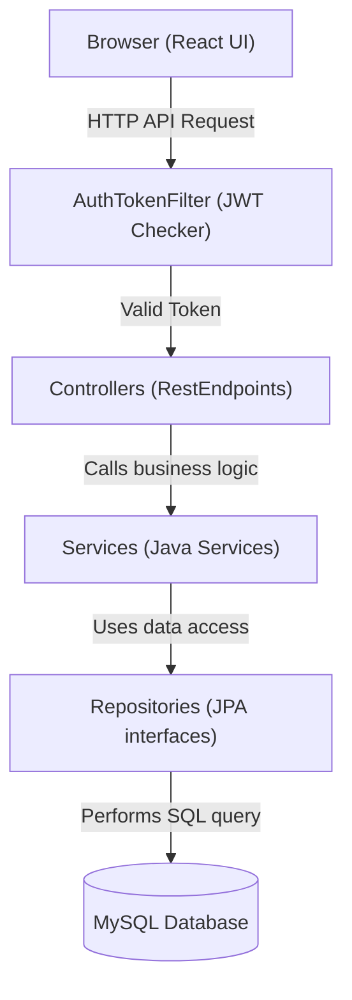
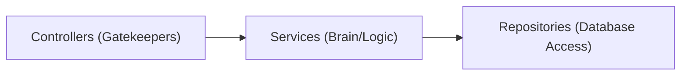
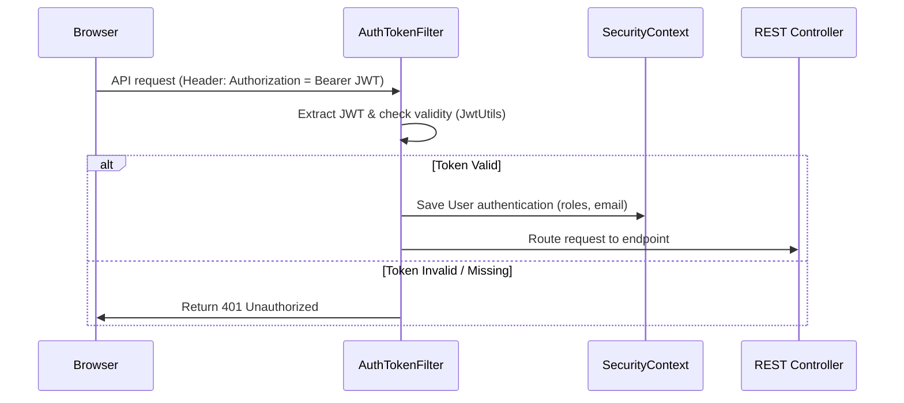
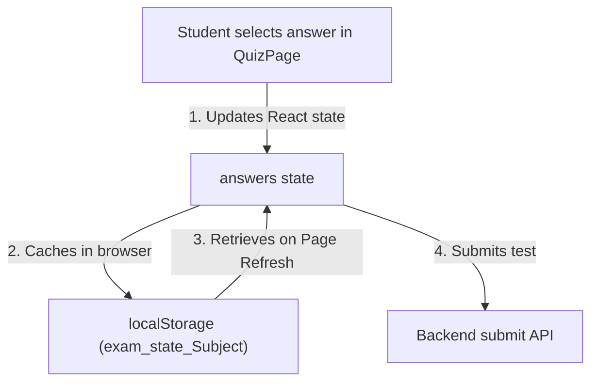

# 🎓 ExamPro - Full System Documentation

Welcome to the complete documentation of **ExamPro**, an online examination and test management system. This document is written in simple, easy-to-understand language to explain every feature, function, technology, and file relationship in the project.

---

## 🛠️ 1. Technologies Used (Tech Stack)

Here is a breakdown of all the technologies that build this application:

| Layer | Technology | Simple Explanation |
| :--- | :--- | :--- |
| **Frontend (UI)** | **React.js** | Builds the user interface, pages, and handles what the user sees in the browser. |
| | **CSS (Vanilla)** | Styles the look and feel of the site (colors, sizes, alignments) with a premium Indigo theme. |
| | **Framer Motion** | Animates page transitions and tab-switches dynamically. |
| | **Lucide React** | Provides modern, clean icons (like hats, clocks, checkmarks) across the UI. |
| **Backend (API)** | **Spring Boot (Java)** | Handles the application logic, databases connection, routes, and math calculations. |
| | **Spring Security** | Restricts which APIs students and admins can call based on their logged-in roles. |
| | **JWT (jsonwebtoken)** | Generates stateless secure login passes (tokens) for logged-in users. |
| **Database** | **MySQL** | Relational Database management system that stores users, questions, and test scores. |
| | **Spring Data JPA** | Translates database SQL commands into easy Java methods (e.g. `save()`, `findAll()`). |
| | **Hibernate** | Maps Java object structures to SQL tables behind the scenes. |

---

## 📊 2. System Architecture & File Relationships

The diagram below shows how the frontend web browser communicates with the backend Java code, and how the database is connected:



---

## 📂 3. Backend Code Details (Java Spring Boot)

The backend code is divided into standard layers. Each layer has a specific job:



### A. Controllers (The Gatekeepers)
Controllers define the API endpoints (URLs) that the frontend can call.

| Controller File | Methods & Functions | Simple Explanation | Related Files |
| :--- | :--- | :--- | :--- |
| **[AuthController.java](file:///c:/Users/user/Desktop/STUDY%20MATERIAL/JAVA%20PEP%20PROJECT/backend/src/main/java/com/examportal/backend/controller/AuthController.java)** | `register()` | Receives registration details, calls `AuthService` to sign up, and returns a session token. | `AuthService`, `RegisterRequest`, `AuthResponse` |
| | `login()` | Receives login email/password, validates them, and returns a session token. | `AuthService`, `LoginRequest`, `AuthResponse` |
| **[StudentController.java](file:///c:/Users/user/Desktop/STUDY%20MATERIAL/JAVA%20PEP%20PROJECT/backend/src/main/java/com/examportal/backend/controller/StudentController.java)** | `submitExam()` | Receives student answers and hands them over to `ResultService` for grading. | `ResultService`, `ExamSubmitRequest`, `ResultResponse` |
| | `getMyResults()` | Retrieves list of all exams taken by the logged-in student. | `ResultService`, `ResultResponse` |
| | `getMyStats()` | Gets aggregate metrics (avg score, best score) for the student dashboard. | `ResultService` |
| | `getProfile()` | Retrieves profile details of the logged-in user (hiding the password). | `UserRepository` |
| **[QuestionController.java](file:///c:/Users/user/Desktop/STUDY%20MATERIAL/JAVA%20PEP%20PROJECT/backend/src/main/java/com/examportal/backend/controller/QuestionController.java)** | `getExamQuestions()` | Downloads questions of a specific subject **without correct answers** for students. | `QuestionService`, `QuestionResponse` |
| | `getAllQuestions()` | Admin retrieves all questions with correct answers. Supports search/filters. | `QuestionService`, `Question` |
| | `addQuestion()` | Admin adds a new question. | `QuestionService`, `QuestionRequest` |
| | `updateQuestion()` | Admin updates details of an existing question. | `QuestionService`, `QuestionRequest` |
| | `deleteQuestion()` | Admin deletes a question. | `QuestionService` |

### B. Services (The Brain / Business Logic)
Services carry out calculations, validations, password encryption, and database updates.

| Service File | Methods & Functions | Simple Explanation |
| :--- | :--- | :--- |
| **[AuthService.java](file:///c:/Users/user/Desktop/STUDY%20MATERIAL/JAVA%20PEP%20PROJECT/backend/src/main/java/com/examportal/backend/service/AuthService.java)** | `register()` | Checks if email exists, hashes passwords with BCrypt, verifies admin security key, and saves user. |
| | `login()` | Asks Spring Security to verify credentials, and builds a JWT token. |
| **[QuestionService.java](file:///c:/Users/user/Desktop/STUDY%20MATERIAL/JAVA%20PEP%20PROJECT/backend/src/main/java/com/examportal/backend/service/QuestionService.java)** | `getQuestionsForExam()`| Loops through questions and builds `QuestionResponse` objects (omits correct answers for safety). |
| | `filterQuestions()` | Checks request arguments and fetches questions filtered by subject or difficulty. |
| **[ResultService.java](file:///c:/Users/user/Desktop/STUDY%20MATERIAL/JAVA%20PEP%20PROJECT/backend/src/main/java/com/examportal/backend/service/ResultService.java)** | `normalizeAnswer()` | Standardizes options (e.g. converting `"optionA"` or `"A"` into `"A"`) to prevent grading errors. |
| | `submitExam()` | Loops through questions, evaluates answers, counts correct/wrong, builds a `Result` record, and returns correct answers map. |
| | `getAdminStats()` | Computes aggregate data (total questions, student counts, average scores) for the Admin Dashboard. |

### C. Security & JWT (Authentication Flow)
Spring Security intercepts every API call to protect the system.



- **[SecurityConfig.java](file:///c:/Users/user/Desktop/STUDY%20MATERIAL/JAVA%20PEP%20PROJECT/backend/src/main/java/com/examportal/backend/config/SecurityConfig.java):** Sets authorization rules (e.g. `/api/auth/**` is public, `/api/student/**` requires `STUDENT` role).
- **[JwtUtils.java](file:///c:/Users/user/Desktop/STUDY%20MATERIAL/JAVA%20PEP%20PROJECT/backend/src/main/java/com/examportal/backend/security/JwtUtils.java):** Contains functions to create a new token, extract email from it, and check if it is expired.
- **[AuthTokenFilter.java](file:///c:/Users/user/Desktop/STUDY%20MATERIAL/JAVA%20PEP%20PROJECT/backend/src/main/java/com/examportal/backend/security/AuthTokenFilter.java):** Intercepts requests, calls `JwtUtils` to validate the token, and signs the user into Spring Security context.

---

## 🖥️ 4. Frontend Code Details (React JS)

The frontend is built with components and views, connected via routes.

### A. Pages & Views

| Page File | Purpose & Features |
| :--- | :--- |
| **[Home.jsx](file:///c:/Users/user/Desktop/STUDY%20MATERIAL/JAVA%20PEP%20PROJECT/frontend/src/pages/public/Home.jsx)** | Landing page showcasing portal features, student reviews, and Call-To-Action (CTA) buttons. |
| **[Login.jsx](file:///c:/Users/user/Desktop/STUDY%20MATERIAL/JAVA%20PEP%20PROJECT/frontend/src/pages/public/Login.jsx)** | Sign-in portal with fields for email, password, and links to registration pages. |
| **[Register.jsx](file:///c:/Users/user/Desktop/STUDY%20MATERIAL/JAVA%20PEP%20PROJECT/frontend/src/pages/public/Register.jsx)** | Integrated registration page containing tab controls to toggle between Student and Admin signup modes. |
| **[QuizPage.jsx](file:///c:/Users/user/Desktop/STUDY%20MATERIAL/JAVA%20PEP%20PROJECT/frontend/src/pages/student/QuizPage.jsx)** | Interactive test interface showing current question, timer, answer palette, and saving progress in `localStorage` dynamically. |
| **[ResultPage.jsx](file:///c:/Users/user/Desktop/STUDY%20MATERIAL/JAVA%20PEP%20PROJECT/frontend/src/pages/student/ResultPage.jsx)** | Displays test score breakdown, confetti effects, and a **Review Answers** panel with green/red correctness badges. |

### B. State Management & Cache Details



- **AuthContext ([AuthContext.jsx](file:///c:/Users/user/Desktop/STUDY%20MATERIAL/JAVA%20PEP%20PROJECT/frontend/src/context/AuthContext.jsx)):** Manages user session state globally. Keeps user info, JWT tokens, and handles logout.
- **LocalStorage progress storage:** Inside `QuizPage.jsx`, test progress is stored under key `exam_state_${subject}` in JSON format:
  ```json
  {
    "answers": { "12": "optionB", "13": "optionC" },
    "timeLeft": 285,
    "currentIdx": 1
  }
  ```
  On mounting, if this object exists in `localStorage`, the exam state is restored seamlessly. It is cleared once the submit request is completed.
